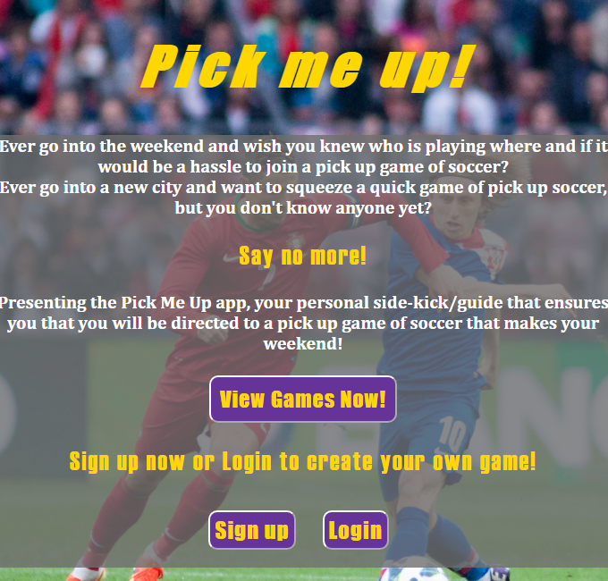
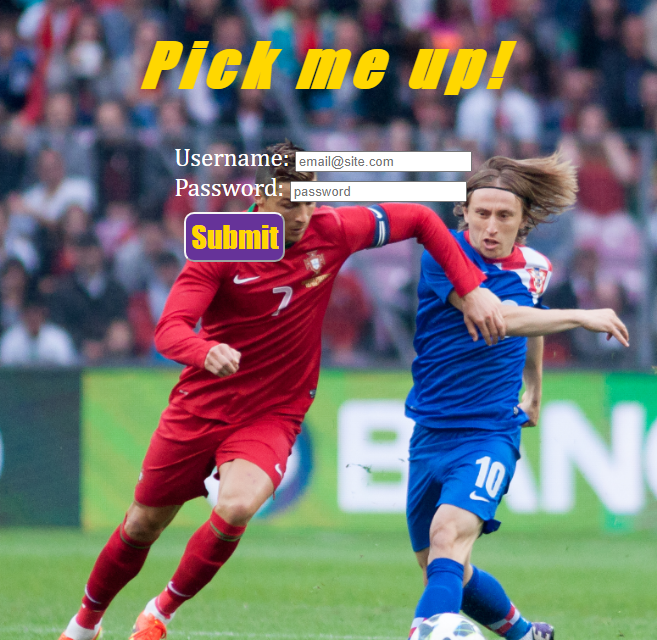
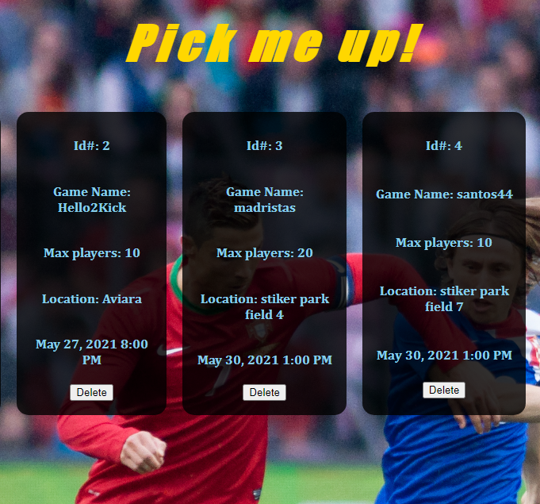
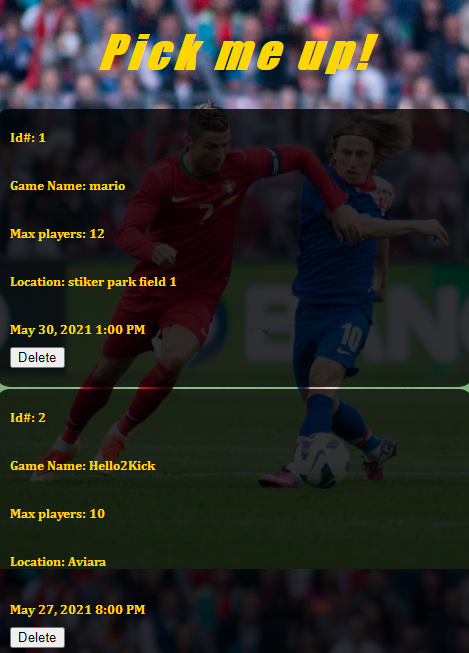

# Pick-Me-Up server

#  <a href="https://pick-me-up-app.vercel.app/">Live Demo</a>

# Screenshots

## Mobile-friendly version

# Summary
This app is the solution to people who share a passion for soccer and would love to get together and play the beautiful game, but don't have the connection. 
Pick-Me-Up shows the place and date of local pick-up soccer games happening in the area and you will never miss out or be misinformed or depend on one friend to get your
weekly soccer that you deserve!

# Tech Used:

- Node.js
- PostgreSQL
- React
- Jquery
- HTML
- CSS
- Javascript
- Heroku
- Vercel

